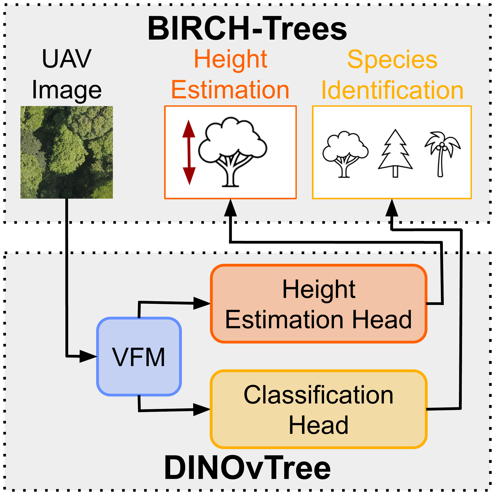
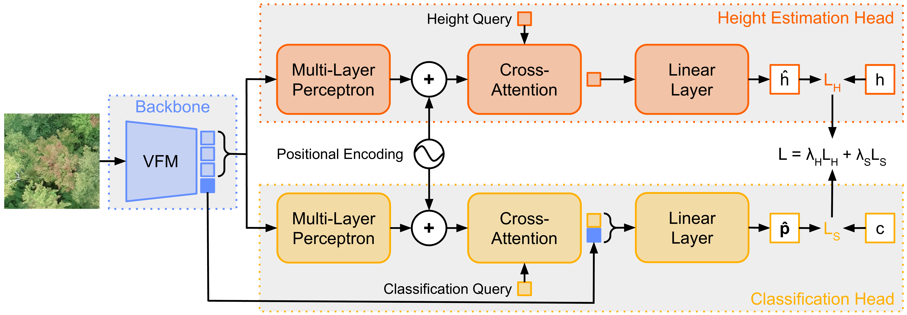

# DINOvTree 🦖🌳

[](https://RolnickLab.github.io/DINOvTree)
[](https://arxiv.org/pdf/2603.23669)
[](https://arxiv.org/abs/2603.23669)
[](https://huggingface.co/datasets/jannikend/birch-trees)
[](https://huggingface.co/jannikend/dinovtree)

This is the official repository of our paper:

**Estimating Individual Tree Height and Species from UAV Imagery**

Authors: [Jannik Endres](https://scholar.google.com/citations?user=imQyM0QAAAAJ&hl=de), [Etienne Laliberté](https://lefo.ca/), [David Rolnick](http://www.davidrolnick.com/), [Arthur Ouaknine](https://arthurouaknine.github.io/)

## 🧭 Table of Contents
1. [Abstract](#abstract)
2. [News](#news)
3. [Method](#method)
4. [Usage](#usage)
   - [Installation](#installation)
   - [Training](#training)
   - [Evaluation](#evaluation)
5. [Repository Structure](#repository-structure)
6. [Acknowledgements](#acknowledgements)
7. [License](#license)
8. [Citation](#citation)

<h2 id="abstract">📝 Abstract</h2>

**TL;DR:** **BIRCH-Trees** is the first benchmark for joint individual tree height estimation and species identification from UAV images. Our model, **DINOvTree**, leverages a VFM to extract features and predicts the height and species of the center tree in the input image with two separate heads.

<table width="90%">
  <tr>
    <td width="40%">
      
    </td>
    <td width="60%">

**Abstract:** Accurate estimation of forest biomass, a major carbon sink, relies heavily on tree-level traits such as height and species. Unoccupied Aerial Vehicles (UAVs) capturing high-resolution imagery from a single RGB camera offer a cost-effective and scalable approach for mapping and measuring individual trees. We introduce BIRCH-Trees, the first benchmark for individual tree height and species estimation from tree-centered UAV images, spanning three datasets: temperate forests, tropical forests, and boreal plantations. We also present DINOvTree, a unified approach using a Vision Foundation Model (VFM) backbone with task-specific heads for simultaneous height and species prediction. Through extensive evaluations on BIRCH-Trees, we compare DINOvTree against commonly used vision methods, including VFMs, as well as biological allometric equations. We find that DINOvTree achieves top overall results with accurate height predictions and competitive classification accuracy while using only 54% to 58% of the parameters of the second-best approach.

   </td>
</tr>
</table>

<h2 id="news">📰 News</h2>

- **26/03/2026:** Our paper is available on [arXiv](https://arxiv.org/abs/2603.23669).

<h2 id="method">⚙️ Method</h2>

<p align="center">
  
</p>

A shared VFM (blue) extracts features from an RGB image. In the height estimation head (orange), a learnable height query cross-attends to adapted patch tokens to predict $\hat{h}$. In the classification head (yellow), a learnable classification query cross-attends to adapted patch tokens to obtain a classification token. We then concatenate it with the VFM [CLS] token to predict $\hat{\mathbf{p}}$. The total loss $\mathcal{L}$ is the weighted sum of the height estimation loss $\mathcal{L}_H(h, \hat{h})$ and the classification loss $\mathcal{L}_S(\hat{\mathbf{p}}, c)$ supervised by ground truth height $h$ and class $c$.

<h2 id="usage">🚀 Usage</h2>

This project requires **Python 3.11**. We use [Hydra](https://hydra.cc) for configuration management and [Weights & Biases](https://wandb.ai/site) for comprehensive experiment tracking and visualization.

<h3 id="installation">🔧 Installation</h3>

#### 1. Set up the environment

First, clone the repository and navigate into it:

```bash
git clone https://github.com/RolnickLab/DINOvTree.git
cd DINOvTree
```

We use [uv](https://docs.astral.sh/uv) for package management. You can install `uv` like this:

```bash
pip install pipx
pipx ensurepath
pipx install uv
```

Next, create the virtual environment and install the dependencies:

```bash
uv venv -p 3.11
source .venv/bin/activate
uv sync
uv pip install -e ./external/facebookresearch_dinov3
uv pip install -e ./external/hugobaudchon_geodataset
```

If you plan to extend the code, install [pre-commit](https://pre-commit.com) to ensure consistent formatting:

```bash
uv run pre-commit install
```

<details>
<summary><b>Alternative: Standard pip installation</b></summary>

If you prefer not to use `uv`, you can create a standard virtual environment and install dependencies via `pip`:

```bash
python -m venv .venv
source .venv/bin/activate
pip install -r requirements.txt
pip install -e ./external/facebookresearch_dinov3
pip install -e ./external/hugobaudchon_geodataset

# Optional: pre-commit installation
pre-commit install
```

</details>

#### 2. Download the BIRCH-Trees benchmark

Download the [BIRCH-Trees benchmark](https://huggingface.co/datasets/jannikend/birch-trees) and store it at a location of your choice, e.g: `./birch-trees`.

*Note: If you choose a location other than `./birch-trees`, you will need to update the paths in the configuration files located in `./configs/dataset/`.*

Once downloaded, unzip the datasets:

```bash
unzip "./birch-trees/datasets/*.zip" -d ./birch-trees/datasets/
rm -r ./birch-trees/datasets/*.zip
```

#### 3. Add URLs to DINOv3 weights

Request access to the DINOv3 weights [here](https://ai.meta.com/resources/models-and-libraries/dinov3-downloads). Once you have your links, create a file named `dinov3_urls.json` in the DINOv3 core directory ([`src/models/dinov3_model/core/`](./src/models/dinov3_model/core/)) and map the model versions to your specific URLs.

For example:
```json
{
  "dinov3_vitb16": "YOUR_PERSONAL_URL_HERE",
  "dinov3_vitl16": "YOUR_PERSONAL_URL_HERE"
}
```

*Note: `dinov3_urls.json` is ignored by Git, so your private links will not be accidentally committed.*

#### 4. Download our pretrained weights

We provide checkpoints for DINOvTree-B trained on the Quebec Trees, BCI, or Quebec Plantations dataset. You can download the checkpoints like this:
```bash
mkdir -p ./checkpoints && \
wget -O ./checkpoints/dinovtreeb_quebectrees.pth "https://huggingface.co/jannikend/dinovtree/resolve/main/checkpoints/dinovtreeb_quebectrees.pth?download=true" && \
wget -O ./checkpoints/dinovtreeb_bci.pth "https://huggingface.co/jannikend/dinovtree/resolve/main/checkpoints/dinovtreeb_bci.pth?download=true" && \
wget -O ./checkpoints/dinovtreeb_quebecplantations.pth "https://huggingface.co/jannikend/dinovtree/resolve/main/checkpoints/dinovtreeb_quebecplantations.pth?download=true"
```

<h3 id="training">🏋️‍♂️ Training</h3>

We trained all models on a single NVIDIA H100 GPU (80GB).

#### DINOvTree-B on Quebec Trees

You can train DINOvTree-B on the Quebec Trees dataset as follows:
```bash
python scripts/train.py experiment=dinovtree_ch_qt
```

#### Configs for other experiments

You can find all configuration files in the [`configs/experiment/`](./configs/experiment/) directory. To train on different datasets or use other models, override the `experiment` flag:

**DINOvTree Models (Classification + Height):**
* `experiment=dinovtree_ch_bci` (DINOvTree-B on BCI)
* `experiment=dinovtree_ch_qp` (DINOvTree-B on Quebec Plantations)
* `experiment=dinovtreel_ch_qt` (DINOvTree-L on Quebec Trees)

**Baselines:**
* `experiment=dinov3_c_qt` (DINOv3 for Classification on Quebec Trees)
* `experiment=resnet_c_qt` (ResNet50 for Classification on Quebec Trees)
* `experiment=maskrcnn_h_qt` (Mask R-CNN for Height on Quebec Trees)

*Note: The allometric equations baseline does not contain trainable parameters and cannot be trained.*

<h3 id="evaluation">📊 Evaluation</h3>

You can evaluate DINOvTree-B by passing the respective experiment config and the path to your downloaded checkpoint.

**Quebec Trees:**
```bash
python scripts/evaluate.py experiment=dinovtree_ch_qt ckpt_path=checkpoints/dinovtreeb_quebectrees.pth
```

**BCI:**
```bash
python scripts/evaluate.py experiment=dinovtree_ch_bci ckpt_path=checkpoints/dinovtreeb_bci.pth
```

**Quebec Plantations:**
```bash
python scripts/evaluate.py experiment=dinovtree_ch_qp ckpt_path=checkpoints/dinovtreeb_quebecplantations.pth
```

<h2 id="repository-structure">📁 Repository Structure</h2>

Here is a high-level overview of our main directories:

* **`configs/`**: Hydra configuration files for our models, datasets, and experiments.
* **`scripts/`**: Entry points for running training (`train.py`) and evaluation (`evaluate.py`).
* **`src/`**: Main Python package containing the core DINOvTree architecture, baseline implementations, and utilities.
* **`external/`**: Third-party code utilized in this project (DINOv3, GeoDataset).

<details>
<summary><b>Click to expand full Repository Structure</b></summary>

```
.
├── configs                        # Hydra configuration files.
│   ├── config.yaml                # Root/default Hydra config.
│   ├── dataset                    # Dataset-specific config group.
│   │   ├── bci.yaml               # BCI dataset config.
│   │   ├── quebec_plantations.yaml # Quebec Plantations dataset config.
│   │   └── quebec_trees.yaml      # Quebec Trees dataset config.
│   ├── experiment                 # Experiment configs.
│   │   ├── allometric_h_qt.yaml   # Allometric equations for height on Quebec Trees.
│   │   ├── dinov3_c_qt.yaml       # DINOv3 for classification on Quebec Trees.
│   │   ├── dinovtree_ch_bci.yaml  # DINOvTree (classification + height) on BCI.
│   │   ├── dinovtree_ch_qp.yaml   # DINOvTree (classification + height) on Quebec Plantations.
│   │   ├── dinovtree_ch_qt.yaml   # DINOvTree (classification + height) on Quebec Trees.
│   │   ├── dinovtreel_ch_qt.yaml  # DINOvTree-L (classification + height) on Quebec Trees.
│   │   ├── maskrcnn_h_qt.yaml     # Mask R-CNN for height on Quebec Trees.
│   │   └── resnet_c_qt.yaml       # ResNet50 baseline for classification on Quebec Trees.
│   └── model                      # Model configs.
│       ├── allometric.yaml        # Allometric model config.
│       ├── dinov3.yaml            # DINOv3 model config.
│       ├── dinovtree.yaml         # DINOvTree model config.
│       ├── maskrcnn.yaml          # Mask R-CNN model config.
│       └── resnet.yaml            # ResNet model config.
├── docs                           # Project documentation assets.
│   ├── figure_method.png          # Method overview figure.
│   └── figure_teaser.png          # Teaser figure shown in abstract section.
├── external                       # External code.
│   ├── facebookresearch_dinov3    # DINOv3 code.
│   └── hugobaudchon_geodataset    # GeoDataset code.
├── LICENSE                        # Repository license.
├── pyproject.toml                 # Project metadata and tooling configuration.
├── README.md                      # Project README file (this file).
├── requirements.txt               # pip dependency list.
├── scripts                        # Entry-point scripts for training/evaluation.
│   ├── evaluate.py                # Evaluation script.
│   └── train.py                   # Training script.
├── src                            # Main Python package source code.
│   ├── models                     # Model implementations.
│   │   ├── allometric_model       # Allometric model package.
│   │   │   ├── allometric_model.py # High-level allometric model wrapper.
│   │   │   └── core               # Core allometric computations.
│   │   │       └── allometric.py  # Allometric equation implementation.
│   │   ├── base_model             # Shared model base class.
│   │   │   └── base_model.py      # Base model class.
│   │   ├── dinov3_model           # DINOv3 model package.
│   │   │   ├── core               # Core DINOv3 model code.
│   │   │   │   └── dinov3.py      # DINOv3 backbone loading/inference logic.
│   │   │   └── dinov3_model.py    # High-level DINOv3 model wrapper.
│   │   ├── dinovtree_model        # DINOvTree model package.
│   │   │   ├── core               # Core DINOvTree modules and heads.
│   │   │   │   ├── dinovtree.py   # Main DINOvTree architecture.
│   │   │   │   ├── modules.py     # Reusable neural network modules.
│   │   │   │   └── task_heads.py  # Height and species prediction heads.
│   │   │   └── dinovtree_model.py # High-level DINOvTree model wrapper.
│   │   ├── maskrcnn_model         # Mask R-CNN model package.
│   │   │   ├── core               # Core Mask R-CNN code.
│   │   │   │   └── maskrcnn.py    # Mask R-CNN implementation/wrapper.
│   │   │   └── maskrcnn_model.py  # High-level Mask R-CNN model wrapper.
│   │   └── resnet_model           # ResNet model package.
│   │       ├── core               # Core ResNet code.
│   │       │   └── resnet.py      # ResNet model code.
│   │       └── resnet_model.py    # High-level ResNet model wrapper.
│   └── utils                      # Shared utilities across models/scripts.
│       ├── augmentor.py           # Data augmentation utilities.
│       ├── head.py                # Shared prediction head building blocks.
│       ├── losses.py              # Loss functions.
│       ├── metrics.py             # Evaluation metrics.
│       ├── scheduler.py           # Learning rate scheduler utilities.
│       └── utils.py               # Generic utility helpers.
└── uv.lock                        # Lockfile for uv-managed dependencies.
```

</details>

<h2 id="acknowledgements">🙏 Acknowledgements</h2>

We thank the authors of [DINOv3](https://github.com/facebookresearch/dinov3), [GeoDataset](https://github.com/hugobaudchon/geodataset), and [DETR](https://github.com/facebookresearch/detr) for releasing their code.

<h2 id="license">⚖️ License</h2>

Our code is licensed under the [Apache License 2.0](LICENSE). The code in the directories `external/facebookresearch_dinov3` and `external/hugobaudchon_geodataset` is adapted from Meta and Hugo Baudchon. They are released under the [DINOv3 License](./external/facebookresearch_dinov3/LICENSE.md) and [Apache License 2.0](./external/hugobaudchon_geodataset/LICENSE), respectively.

<h2 id="citation">📚 Citation</h2>

If you find our work useful, please consider citing our paper:

```bibtex
@article{endres2026treeheightspecies,
  title     = {Estimating Individual Tree Height and Species from UAV Imagery},
  author    = {Endres, Jannik and Lalibert{\'e}, Etienne and Rolnick, David and Ouaknine, Arthur},
  journal   = {arxiv:2603.23669 [cs.CV]},
  year      = {2026}
}
```
